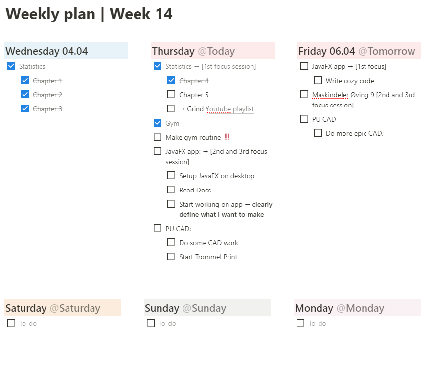

### TDT4100: Project:

# Weekly Planner

This project will be a weekly planner app, similar to what I have already created as a template for in Notion, but it will consume less power and RAM (fuck Electron apps).

An example of the UI I have planned can be found underneath:

 

<!-- 
 -->

Functionality that sets it apart from the example project:

<ul>
  <li>Time Estimates for each task</li>
  <li>Similar to <a href="https://github.com/johannesjo/super-productivity">super-productivity</a> in that u can plan your day and it will keep track of pomodoro timers.</li>
  <li>When a day is "over", uncompleted tasks will be moved to next day</li>
  <li>The app will save the task, time spent/remaining etc to a separate file</li>
  <li>It will look better and cooler, and will be useful.</li>
  
</ul> 
