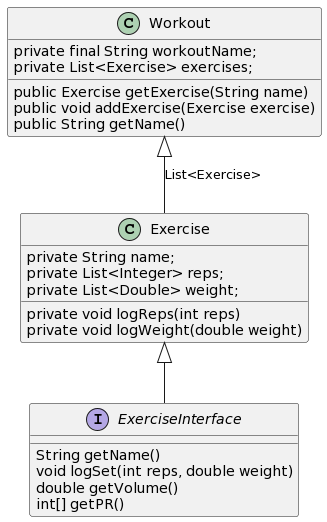

### TDT4100: Project:

# **Workout Logger and Tracker**

## Part 1: What the app does

The app constructed severs as a workout tracker and logger. The idea here is that you can create a workout program, and keep track of hour your lifts are increasing over time. And this ensure that you are doing sufficient progressive overload to maximize your gains.

## Part 2: Diagram
See picture:

 

## Part 3: 
1. What parts of the curriculum are covered? 
    I would say Interfaces and Observe/observable is mainly useful here. Interfaces simply just to tick a box, but it would make more sense if each exercise was its own class. However I do not have time to program that, nor do I see a reason for it. It could have been more useful if I had split it up into different sub-classes of exercises (strength logs reps and weight, cardio logs time and distance). Observe/Observable technique is used to know when a save-command is issued by the user, and will thus activate the save functionality of the `FileHandler` class.

2. Inheritance could have been used if for instance i had different types of workouts, each with some separate data-fields, but enough similarity to each other that inheritance could make sense. I cannot really find any examples of where delegation would be useful in this case. Maybe if there were like multiple threads doing some sort of computation, i could have delegated the computation to the least loaded core, but yeah that makes no sense for an app like this.

3. I think it sticks to the MVC principle quite well, most of the back-bone of the code takes place in the Model section. In essence the program could run without the GUI, except saving would still require some sort of input.

4. Tests have been quite ok to program. It was mainly testing if all the basic functionality would work as intended (saving works, handling duplicate workouts and entries, special characters). Not all parts of the code have been tested because there is probably a lot I did not think about. Could probably have asked chatGPT to generate some tests... However I think that as long as the core functionality works as intended, the app is "ready". If someone decides to enter some freaky hexadecimal binary hackerman code into the text field, that's on them.  